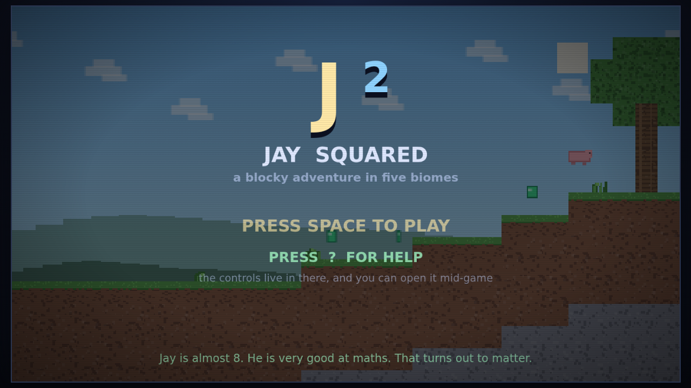
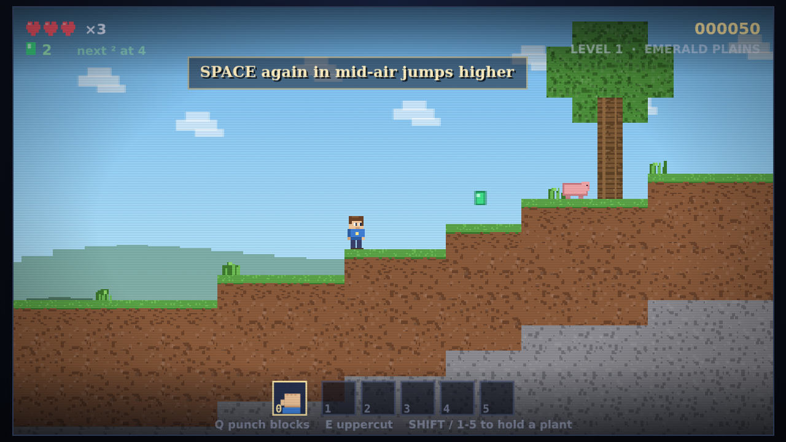
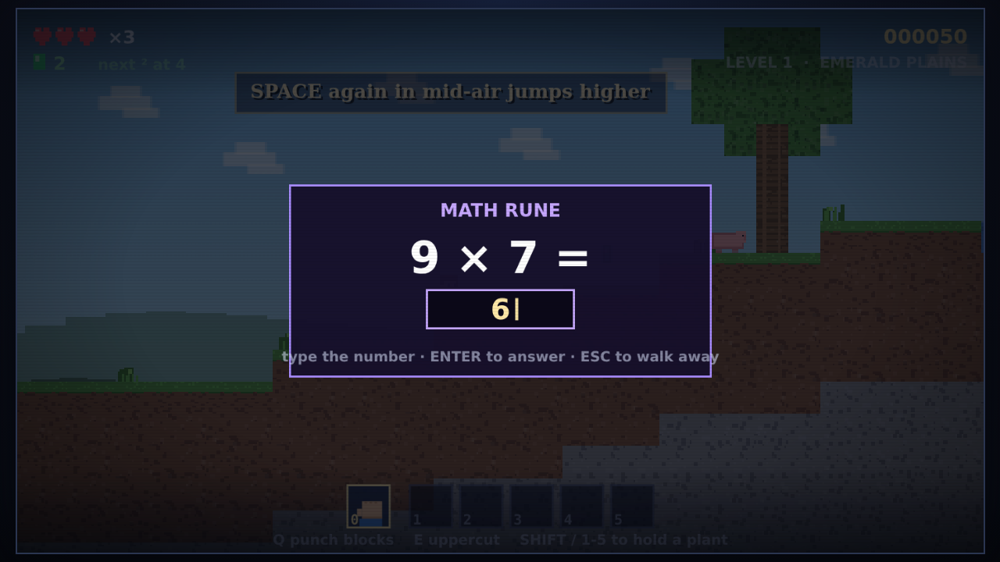
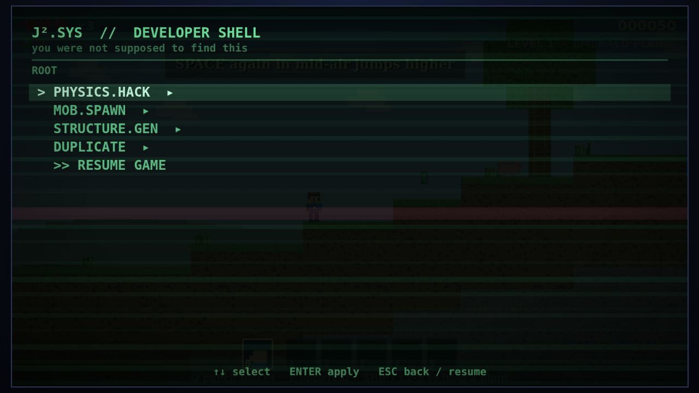

# Jay Squared (J²)

A 2D platformer in the spirit of the old Mario games, built out of Minecraft-ish
blocks, where being good at maths is the actual superpower.

Jay is almost 8. He is very good at maths. That turns out to matter.

The whole game is **one HTML file with no dependencies** — open
[`jay-squared.html`](jay-squared.html) in a browser and it runs. Nothing to
install, nothing to serve.



## Playing it

Download `jay-squared.html` and double-click it, or clone this repo and open the
file. It works offline; there is no build step required to play.

### Controls

| Key | Does |
| --- | --- |
| `←` `→` | walk (`A` / `D` also work) |
| `↑` | jump · climb a ladder, vine or tree trunk |
| `↓` | crouch · climb down |
| `SPACE` | jump — press again in mid-air to go higher, up to five times |
| `↓` + `SPACE` | drop through wooden planks |
| `Q` | use power · with bare hands, hold to punch blocks apart |
| `E` | second power · uppercut |
| `TAB` + `Q` | **squared** — the Q power, twice over |
| `0` | bare hands |
| `1`–`5` | choose an inventory slot (number pad works too) |
| `SHIFT` | cycle through what you are carrying |
| `P` or `ESC` | pause |
| `?` or `H` | help, at any time |



## The maths

This is the part that makes the game what it is, rather than a reskin.

**Perfect squares pay out.** Your gem total is always on screen along with the
next perfect square to aim for. Landing exactly on 4, 9, 16, 25, 36… triggers a
reward, and which reward depends on the root: multiples of 5 give a 1-UP,
multiples of 3 give a heart back, and 4 hands over the Gem Magnet.

**Runes set sums.** The purple runes scattered through each level ask a question
scaled to the level you are on — addition in the plains, multiplication and
squares by the castle. Answer correctly for 1-UPs, gem showers and abilities.
Get it wrong and the rune sulks for a few seconds before you can retry.



The five abilities are Swift Feet, Gem Magnet, Extra Heart, Squared Mind (TAB
doubles `E` as well as `Q`) and Feather Fall. They stack, and they show in the
bottom-left corner as you collect them.

## The five plants

Each one is a slot item with two distinct moves, plus a doubled variant on
`TAB`+`Q`:

| Plant | `Q` | `E` |
| --- | --- | --- |
| Wind Plant | gust | twin orbs |
| Electric Plant | zap ray | blast off (fries anything under or beside you) |
| Lava Mushroom | magma ball | eruption |
| Earth Plant | spike row | spike nova |
| Water Mushroom | blinding squirt | freeze |

Bare hands are always available on `0`: `Q` punches blocks apart, `E` uppercuts.

## Five biomes

Emerald Plains → Dripstone Deep → Sunburn Dunes → Cinder Hollow → The Cobalt
Castle. Each level is procedurally generated from a fixed seed, so the layouts
are stable between runs but nothing is hand-placed.

## Secrets

Mild spoilers, in the order a player is likely to find them.

- **`144`** typed on the title, pause or game-over screen turns on Explorer
  Mode (12² — Jay still takes hits and gets knocked around, but he is put back
  on the last solid ground instead of dying, and the life count never drops).
  Type it again to turn it off.
- **`169`** (13²) opens the glitch menu directly, from those same screens.
- **The glitch menu** is the real easter egg, and it is meant to be found by
  accident: fire a power and then fall into the void within about 1.6 seconds,
  and instead of dying you drop into a fake developer shell that will let you
  edit gravity, spawn mobs, generate structures and duplicate your gems. Once
  per level.



## Working on it

The single HTML file is **generated**, not edited directly. Source lives in
`src/`, concatenated in filename order:

| File | Contains |
| --- | --- |
| `00-head.html` | HTML shell, both canvases, CSS |
| `10-core.js` | constants, input, tile table, audio |
| `20-world.js` | level configs and the procedural generators |
| `30-entities.js` | player, mobs, items, projectiles, collision |
| `40-powers.js` | the five plants and bare hands |
| `50-math.js` | squares, runes, abilities, cheats, glitch menu |
| `70-render.js` | both canvases, HUD, help screen, overlays |
| `80-loop.js` | fixed-timestep loop and state machine |
| `99-tail.html` | closing tags |

```sh
./build.sh          # src/* -> jay-squared.html
```

Rendering is split across two canvases on purpose: a 480×270 `#game` canvas
upscaled with nearest-neighbour for the blocky look, and a 3× supersampled
`#hud` canvas on top so that text and UI stay crisp instead of inheriting the
pixelation.

### Tests

The suites drive a real headless Chromium through Playwright, pressing actual
keys and asserting against internal state exposed on `window.J2`. Several of
them measure rendered pixels rather than trusting a screenshot by eye — 
`align.js` checks help-row text is centred to within a pixel, and `collapse.js`
hooks the canvas transform to verify reward banners land on their HUD target.

```sh
npm install
npm test                  # every suite
node tests/test.js        # just one
```

`tests/run-all.js` treats a suite as failed on a non-zero exit, a `✗` in the
output, or any reported page error.

## Credits

Made for Jay, with Claude. MIT licensed — see `LICENSE`.
